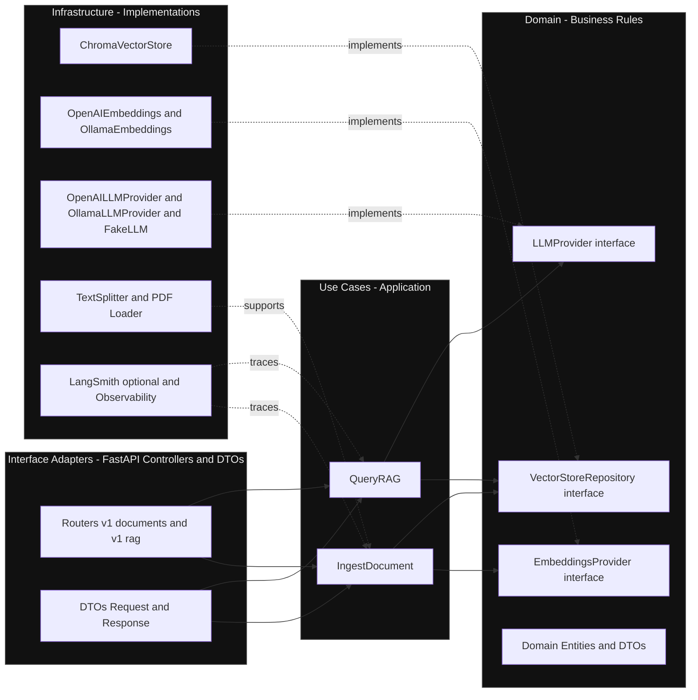
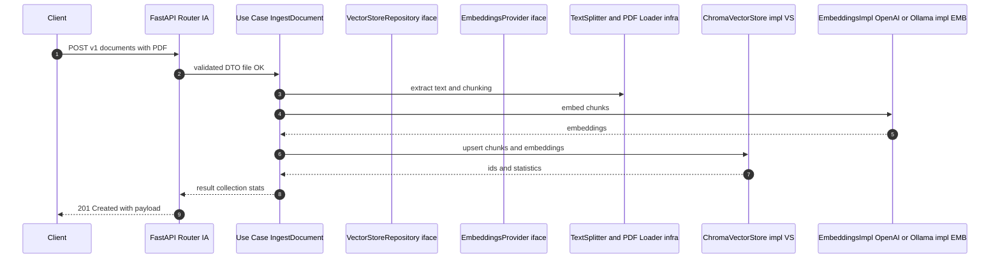
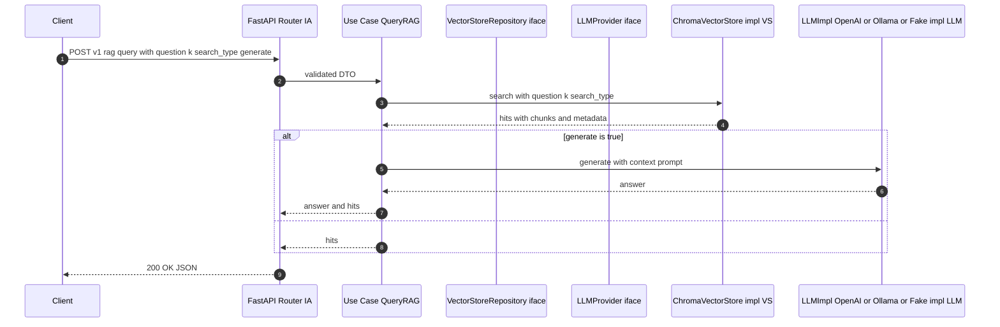

# Clean Architecture - RAG FastAPI (Cheat Sheet)

## 1) Dependency Rules (Layer Overview)

Rule: dependencies always point inward. Use cases depend only on domain interfaces. Infrastructure implements those interfaces.

---

## 2) Flow - Upload and Ingest POST v1 documents

Quick Notes:
- Validation happens in the adapter layer with FastAPI and DTO.
- IngestDocument does not know Chroma or OpenAI. It only talks to interfaces.
- Real implementations such as Chroma OpenAI and Ollama are injected at the composition root.

---

## 3) Flow - Query RAG POST v1 rag query

Key Params:
- k controls the number of chunks retrieved
- search_type can be similarity or mmr
- generate when true triggers the LLM call otherwise the API returns only the hits

---

## 4) Testability - Fixtures and DI
- Dependency Injection: use cases receive LLMProvider EmbeddingsProvider and VectorStoreRepository through constructor injection
- Fixtures with pytest: create fake implementations such as FakeLLMProvider and FakeVectorStore for deterministic and fast tests
- Integration tests: run with real Chroma and LLM based on env and -m integration markers

---

## 5) Observability optional
- LangSmith enabled via env for chain tracing prompt logs and latency metrics
- Helps debug hallucinations and measure prompt and context quality

---

## 6) Main Routes - Adapters
- POST v1 documents for ingestion embeddings and upsert
- GET v1 documents for collection stats
- POST v1 rag query for retrieval and optional generation

---

## 7) Architecture Benefits
- Low coupling use cases know nothing about external tools
- High testability with mocks and fakes without network calls
- Easy evolution swap Chroma for PGVector swap OpenAI for Ollama or adjust chunking without touching domain logic
